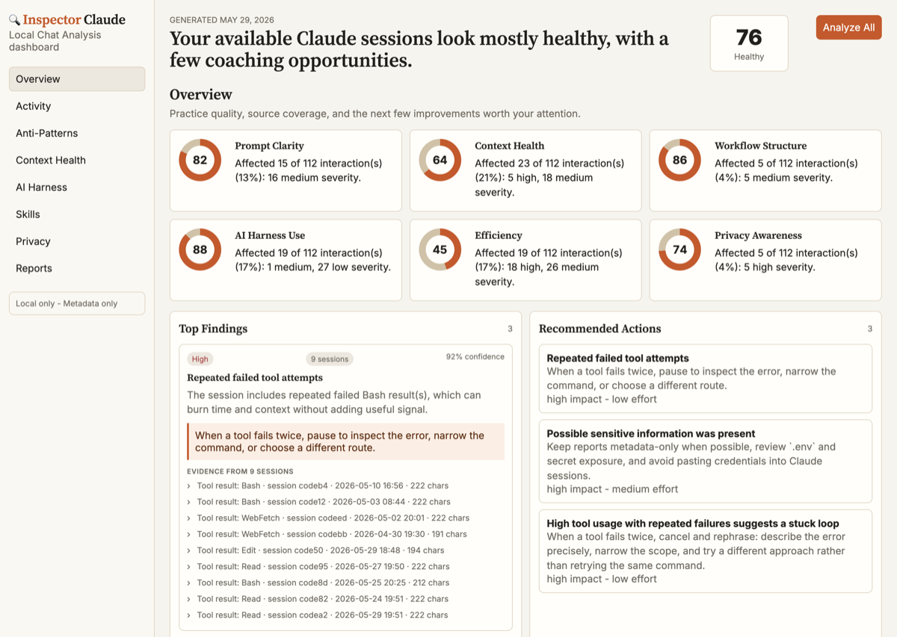
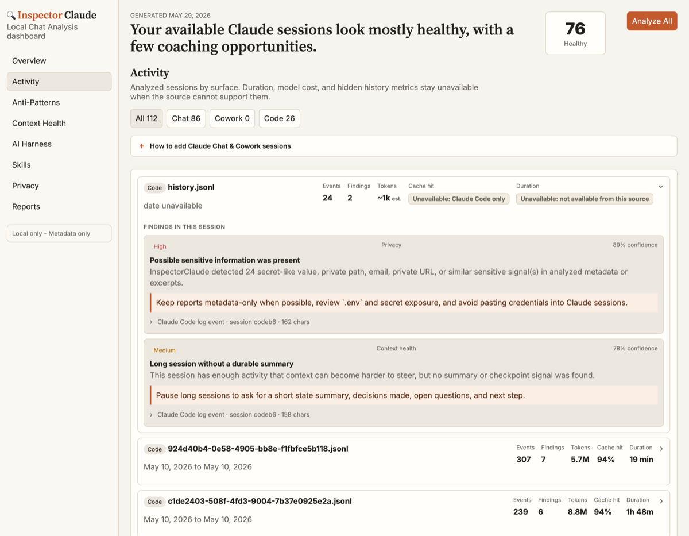

# InspectorClaude

**A local-first coaching dashboard for how you use Claude.**

InspectorClaude reads your Claude Code session logs, scores them against a set of
deterministic coaching rules, and tells you how to work with Claude more
effectively. It surfaces findings and recommendations across seven areas:

| Area | What it looks at |
|---|---|
| **Prompt Clarity** | Vague prompts, repeated corrections, ambiguous scope |
| **Context Health** | Topic shifts without summaries, context bloat, weak compaction |
| **Workflow Structure** | Edits without verification, missing done criteria, sequential vs. parallel tool use |
| **AI Harness Use** | Missing `CLAUDE.md`, repeated prompt patterns, unused skill opportunities |
| **Efficiency** | Repeated file reads, duplicate output, broad searches, tool-failure loops |
| **Privacy Awareness** | Secrets, emails, or private paths appearing in prompts or responses |
| **Session Hygiene** | Overly long sessions, frustration signals, responses accepted without a review window |

It also tracks **per-session token usage** — total tokens, cache-hit rate, and a flag on
sessions that burn far more than your own typical session.

Everything runs on your machine. No telemetry, no database, no cloud sync.

<p align="center">
  
  <br/>
  <em>Overview — coaching scores across six areas, with top findings and recommended actions.</em>
</p>

<p align="center">
  
  <br/>
  <em>Activity — per-session token usage and cache-hit, with click-to-expand findings for each session.</em>
</p>

---

## Quick start

### Option A — Claude Code plugin (recommended)

Install once, then use it from any Claude Code session:

```bash
npx inspectorclaude setup-plugin --plugin-dir ~/.claude-plugin/inspectorclaude
```

```
/inspectorclaude:open-dashboard
```

Claude reads your local logs automatically and returns a structured coaching report.

### Option B — Visual browser dashboard

```bash
npx inspectorclaude-serve
```

Ask Claude to "show me my InspectorClaude dashboard," then open the live results at:

```
http://localhost:3765/preview
```

### Option C — Standalone MCP server

Add to `~/.claude/mcp_settings.json`:

```json
{
  "mcpServers": {
    "inspectorclaude": {
      "command": "npx",
      "args": ["inspectorclaude-mcp"]
    }
  }
}
```

---

## MCP tools

| Tool | What it does |
|---|---|
| `show_dashboard` | Reads local Claude Code logs and returns the full dashboard model. |
| `analyze_code_logs` | Read-only analysis of Code JSONL logs (`since`, `limit`, `projectPath` filters). |
| `analyze_current_chat` | Analyze chat text or a summary you provide. |
| `import_transcript` | Analyze an imported Chat, Cowork, or Code transcript. |
| `record_cowork_checkpoint` | Analyze a Cowork checkpoint stage. |
| `get_coaching_report` | Return a coaching report as JSON or Markdown. |
| `recommend_improvements` | Return recommendations and skill opportunities. |
| `export_report` | Export a dashboard as Markdown or JSON. |

---

## Privacy

- **Local only** — analysis never leaves your machine, and results live only in memory.
- **Metadata-first** — redacted excerpts are included only when you pass `includeEvidence: true`.
- **Nothing is scraped** — Chat and Cowork data are analyzed only when you explicitly provide them. InspectorClaude never reads Claude app databases or hidden history.
- **Secrets are redacted** — API keys, tokens, emails, private keys, and local paths are replaced with `[REDACTED_*]` tags before appearing in any finding or report.

---

## Development

```bash
npm install
npm run build
npm test
```

Run the dashboards locally:

```bash
npm run serve      # MCP app server → http://localhost:3765/preview
npm run dashboard  # standalone dashboard → http://localhost:8765
```

---

## License

MIT — see [LICENSE](LICENSE).
